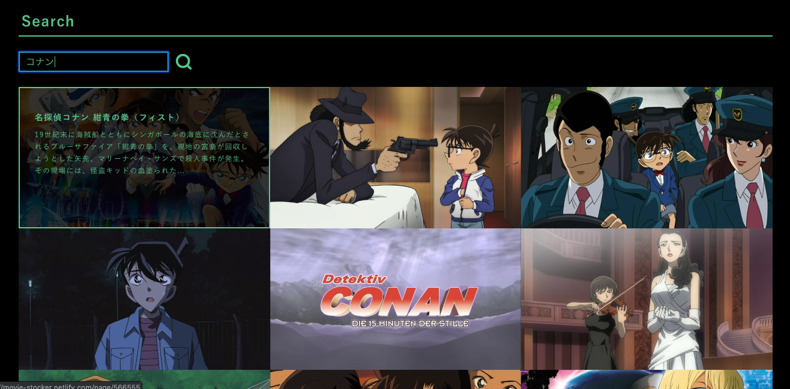

# MovieStocker
映画をお気に入り登録するwebサイト  
https://movie-stocker.netlify.com/  



## Description
映画を検索し、お気に入りに追加することが可能です。  

・APIはTMdbを使用しています。  
・お気に入り登録機能はローカルストレージに値を保存する方法で実装しています。  

## Development information
VueとNuxt.jsを触ってみたいと思い作り始めました。  
開発工数: 32h程度  


## Build Setup

``` bash
# install dependencies
$ npm install # Or yarn install

# serve with hot reload at localhost:3000
$ npm run dev

# build for production and launch server
$ npm run build
$ npm start

# generate static project
$ npm run generate
```

For detailed explanation on how things work, checkout the [Nuxt.js docs](https://github.com/nuxt/nuxt.js).

